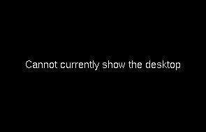
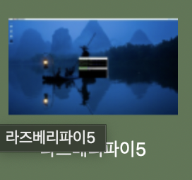
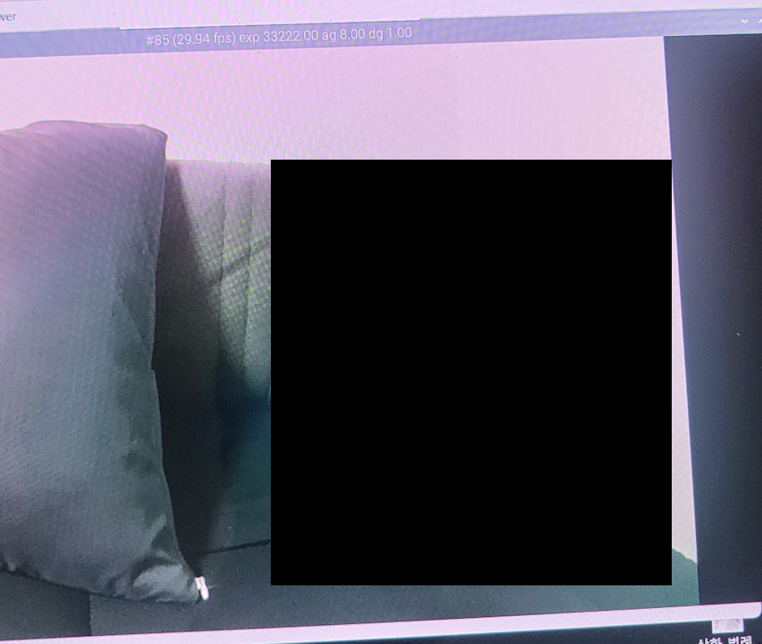
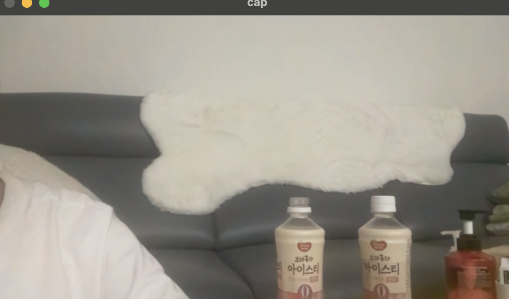
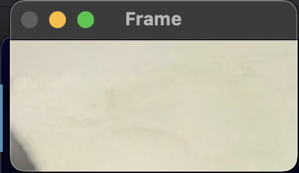
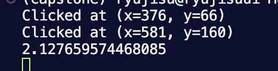

작성일 : 2024-04-19

---

```
    💡 회의 규정

    주간 회의는 최소 총 2회로 오프라인 회의(월), 온라인 회의(화~금)로 구성된다.
    필요 시 온라인 회의도 오프라인 회의로 변경할 수 있다.

    월요일 오프라인 회의 및 개발 진행 (18시 이후)
    장소 : 인천대학교

    온라인 회의 및 개발 진행 (20시 이후)
    장소 : 디스코드
```

### **4월 2주차 (0408-0414)**

---

- **1차 오프라인 회의 )** 2024-04-16 **(18:00 ~ 22:00)**
- **2차 온라인 회의 )** 2024-04-17 **(15:00 ~ 16:30)**

> 팀원 **전체가 참여**한 회의만 기록하였습니다.

<br/>

### **주요 업무**

---

라즈베리파이 VCN 설정,카메라 세팅, 카메라 opencv 코드(1), 수선의 발 코드

### **진행 상황**

---

IR 카메라가 도착하지 않은 관계로 해당 제품 없이 할 수 있는 업무를 우선 수행하였음.

<br/>

### 라즈베리파이 VNC 설정

<br/>
라즈베리파이를 연결할 모니터를 챙기지 못하여 VNC 설정을 함.
VNC 설정 과정에서 raspi-config에 VNC 해상도 resolution 옵션이 보이지 않는 문제가 있었음.



- 접속은 되었으나 resolution 문제로 VNC Viewer에서 라즈베리파이 화면이 보이지 않는 상황



- resolution missing 문제 해결 후 화면이 제대로 보이는 모습

VNC enable과 raspi-config 업데이트 문제였던 것으로 판단됨.
문제를 파악하기까지 시간이 많이 소비되었으나 해결방법은 간단했음.

- **참고 문서**

  - [raspi-config resolution is missing](https://forums.raspberrypi.com/viewtopic.php?t=331610)

<br/>

### 카메라 환경 세팅

<br/>

라즈베리파이 광각 카메라(YR-019, Raspberry Pi)
cam0에 카메라를 연결 및 환경세팅을 진행한 후 `libcamera-hello`로 카메라 출력을 확인하는 과정에서 에러가 발생함.

카메라 인식 관련 에러로 모두 사용 가능한 카메라를 찾을 수 없다는 내용이었음

#### 에러 메세지

- `error: XDG_RUNTIME_DIR is invalid or not set in the environment.
Made X/EGL preview window
ERROR:  no cameras available`
- `vcgencmd get_camera
vc_gencmd_read_response returned -1
error=1 error_msg="Command not registered"available`

- /boot/firmware/config.txt 파일 수정 사항

  - `camera-auto-Detect=1` 문구를 `camera-auto-Detect=0`으로 수정
    - 다양한 블로그, 깃허브를 참고한 결과 : 1은 정품 카메라 인식, 0은 정품 카메라 외 카메라를 인식한다고 함. 우리는 1을 0으로 수정하였음.
  - `camera-auto-Detect=0`으로 수정할 경우 사용된 카메라 센서에 맞게 dtoverlay 설정을 해주어야함.
    - 구매한 카메라 데이터시트가 없어 module을 확인하지 못함. 서치 과정에서 zero module 관련 글이 있었으나 공식x.
    - dtoverlay=(카메라 센서에 맞는 값), cam0 <- 라즈베리파이5의 경우 카메라 연결 단자가 2개이기 때문에 설정해주어야한다고함.

  라즈베리파이 카메라 환경 세팅 글을 참고하여 위와 같이 config.txt 파일을 수정하였으나 사용 가능한 카메라를 찾을 수 없다는 에러메세지가 출력됨.

- 정확한 원인이 무엇인지 몰랐기 때문에 문제를 해결하기 위해 단계별로 접근하였음.

  1. 카메라가 고장 확인 : 카메라를 다른 보드에 연결하여 정상적으로 동작하는 지 파악
     -> 라즈베리파이4에 연결하여 카메라가 동작하는 것을 확인함.
     -> 케이블이나 카메라 고장으로 인해 카메라가 인식되지 않는 것 아닌가라는 의구심 해결
     -> 환경 세팅이 잘못되었다고 판단함.
  2. config.txt 수정 전으로 reset
     -> 라즈베리파이4에 카메라 연결하고 사용 가능한 카메라 리스트 확인 결과 리스트가 출력되지 않음.
     -> 그러나 미리보기 출력했을 때 정상적으로 작동함.
     -> config.txt reset 후 미리보기 출력 코드 작성
     -> 라즈베리파이5에서 카메라 정상 작동 확인



- **참고 문서**

  - [라즈베리파이5에서 카메라 사용하기](https://blog.naver.com/no1_devicemart/223305384819)
  - [Docs: Raspberry Pi Camera](https://www.raspberrypi.com/documentation/computers/camera_software.html#introducing-the-raspberry-pi-cameras)

  <br/>

### 카메라 opencv 코드(1) 작성

깃허브 > capstone > opecv > findall_0417.py - crop 코드
깃허브 > capstone > opecv > utils.py - px to mm 코드

ir positioning camera가 아직 도착하지 않은 관계로 픽셀 좌표를 내부 임의의 좌표로 매핑하는 코드 작성이 힘듦.
ir positioning camera가 도착하기 전에 영상프레임에서 필요한 부분만 crop하는 코드를 작성함.

- crop 코드

  - 마우스 첫번째 클릭 좌표 (x1, y1), 마우스 두번째 클릭 좌표 (x2, y2)에 대해 기존 창 사이즈를 (x2-x1, y2-y1)으로 변경
    이는 골프 매트 영역만 유효하게 하기 위함

- px to mm

  - 소지하고 있는 골프 매트의 width는 200mm임. 즉 crop 영상의 height(px)을 200mm라고 할 수 있음.
  - 1px : crop영상의 height(px) = 알고싶은 값 : 200mm 수식을 이용하여 1px이 몇 mm인지 계산하는 함수를 작성함.

기본



crop(376~586, 66~160 영역 crop한 버전)



마우스 클릭한 영역 좌표 출력 및 1px to 1mm 결과



<br/>

### 수선의 발 코드 작성

깃허브 > capstone > opecv > utils.py

공, 헤드, 정렬을 위해 필요한 로직 작성
홀 좌표에서 헤드 ir 센서 2 좌표를 연결한 직선 l에 대하여 수선의 발을 구한 후 ir 센서 2개의 거리 내에 수선의 발이 포함될 경우 정렬이 되었다고 파악.

```
def find_foot(a1, b1, a2, b2, a3, b3):
    # a1, b1 / a2, b2는 헤드 ir센서의 좌표
    # a3, b3는 홀의 좌표

    # 직선 l의 기울기 계산
    if a2 - a1 != 0:
        m = (b2 - b1) / (a2 - a1)
    else:
        m = float('inf')  # Handle vertical lines

    # Calculate perpendicular slope
    if m != 0:
        m_perpendicular = -1 / m
    else:
        m_perpendicular = float('inf')  # Handle vertical lines

    # 수선의 발 계산
    x_foot = (a3 + m * b3 - m * b1 + m * a1) / (m + 1/m)
    y_foot = b3 + m_perpendicular * (x_foot - a3)

    return x_foot, y_foot
# x_foot, y_foot이 헤드 범위 밖이라면 정렬x로 판단
```

  <br/>

### 발생한 이슈 & 해결

**이슈 1**: VNC Resolution Missing

- VNC enabled가 되지않고 멈춤
- raspi-config에서 resolution 옵션이 보이지 않음

**해결 방법 1**:

raspi-config에서 VNC enabled를 선택했을 때 넘어가지않는 문제가 있었으나 업데이트/업그레이드 후 해결
enabled 해결 후 resolution 옵션이 생김.

```
sudo apt-update
sudo apt-upgrade

raspi-config -> update 진행
```

<br/>

**이슈 2**: 라즈베리파이5 카메라 no camera available

환경 설정을 잘못해서 발생한 문제.

```
error: XDG_RUNTIME_DIR is invalid or not set in the environment.
Made X/EGL preview window
ERROR:  no cameras available

tech-pioneers@raspberrypi:~ $ vcgencmd get_camera
vc_gencmd_read_response returned -1
error=1 error_msg="Command not registered"
```

**해결 방법 1**: 라즈베리파이5는 이전 버전과 달리 raspi-config에서 camera 설정을 따로 해줄 필요없음. 추가 환경설정없이 연결 시 출력이 가능함.

```
/boot/firmware/config.txt

camera-auto-Detect=1
```

<br/>

### 회고

생각지 못한 환경 세팅 문제로 시간을 많이 소비하였다. 또한 중요한 제품이 늦게 도착하여 진행도가 많이 뒤쳐졌는데 시험기간 이후 주말에도 만나면서 기존 계획서 진도에 맞추기 위해 노력해야할 것 같다.

<br/>

### TO DO LIST

1. 어안 카메라 보정
2. 픽셀 좌표 임의의 내부 좌표로 매핑
