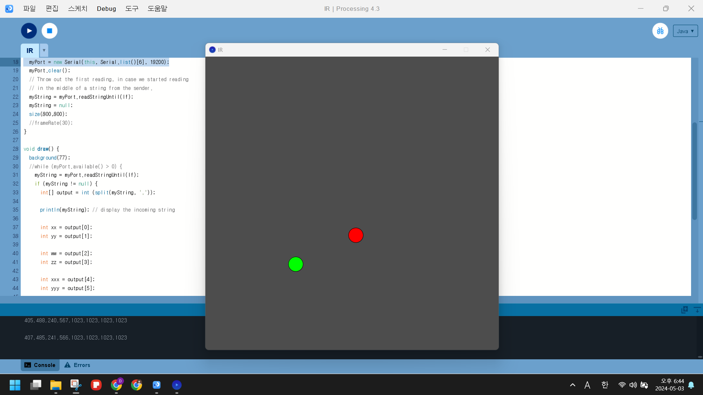

작성일 : 2024-05-04

---

```
    💡 회의 규정

    주간 회의는 최소 총 2회로 오프라인 회의(월), 온라인 회의(화~금)로 구성된다.
    필요 시 온라인 회의도 오프라인 회의로 변경할 수 있다.

    월요일 오프라인 회의 및 개발 진행 (18시 이후)
    장소 : 인천대학교

    온라인 회의 및 개발 진행 (20시 이후)
    장소 : 디스코드
```

### **5월 1주차 (0428 - 0505)**

---

- 1차 오프라인 회의 ) 2024-05-01 (10:00 ~ 16:00)
- 2차 오프라인 회의 ) 2024-05-03 (18:00 ~ 21:00)
- 3차 온라인 회의 ) 2024-05-04 (20:00 ~ 21:30)

> 팀원 **전체가 참여**한 회의만 기록하였습니다.

### 주요 업무

---

- Picamera로 OpenCV 열기
- 어안 카메라 보정
- PCB 납땜
- 라즈베리파이에서 IR 센서 값 받아오기
- 범위 이탈한 공 알림음 발생

### 진행 상황

---

부품이 다 도착하였고, 중간고사도 끝나서 본격적인 개발에 몰두하였다. PC로 작업한 프로그램을 라즈베리파이로 옮기는 게 주요 관건이었다.
<br> <br/>

### Picamera로 OpenCV열기

이전에 웹캠으로 테스트 한 코드를 picamera를 사용하는 코드로 변경하였다. 이 과정에서 몇 가지 문제가 발생했다.

- 기존 코드 방식 (`cv2.VideoCapture(0)`) → `Picamera2()` 수정

  ```python
  //기존 방식
  vs = cv2.VideoCapture(0)

  //새로운 방식 (import 생략)
   picam2 = Picamera2()
   picam2.preview_configuration.main.size=(640, 400)
   picam2.preview_configuration.main.format = "RGB888"
   picam2.start()

   while True:
       cap = picam2.capture_array()
  ```

- 라즈베리파이5 OS에서의 picamera 에러 → OS 재설치로 해결
  - PiCamera 공식 문서를 참고해서 설치를 진행하였으나, 제대로 작동하지 않았다. 찾아보니, 우리가 사용하고 있는 Bookwarm OS에 이미 PiCamera가 설치되어 있다고 했다. 라즈베리파이4를 이용한 테스트에서는 잘 돌아가는 것을 확인했지만, 라즈베리파이5에서는 작동되지 않아, OS를 새로 설치해 해결했다.

<br> <br/>

### 어안 카메라 보정

- DarkCamCalibrator 애플리케이션을 사용하여 라즈베리파이5와 연결된 카메라 렌즈의 초점 거리, 주점, 왜곡 계수를 추출하여 왜곡 정도를 파악하였다. 촬영한 이미지를 사용하여 카메라 보정을 진행하였다.
- 이미지 촬영을 위해, 먼저 보정하는 데 사용하기 위한 패턴을 프린팅하였고 카메라로 해당 패턴을 다양한 각도에서 촬영하였다.
- 적게는 20장으로도 보정할 수 있다고 하나 우리는 약 120장의 이미지를 사용하였다. 사용 이미지는 `opencv/image1`에 저장되어 있다.
  

  보정하지 않은 상태로 데이터 수집


DarkCamCalibrator 애플리케이션을 이용하여 보정을 위한 데이터 추출

- 보정 데이터 수집
  여러 번의 버전으로 나누어 테스트 하여 적절한 값을 선정하도록 하였다. 밑의 데이터들 중 v3 값이 가장 적절하다고 판단하여 v3로 선정하여 코드를 작성하였다.

```python
 -------------v1--------------- (img)
 fx = 297.454574
 fy = 297.454574
 cx = 300.000000
 cy = 200.000000
 k1 = -0.237153
 k2 = 0.025004
 p1 = -0.008951
 p2 = -0.010148

 -------------v2--------------- (jmg)
 rms = 2.948340
 fx = 335.827093
 fy = 335.827093
 cx = 300.000000
 cy = 200.000000
 k1 = -0.354948
 k2 = 0.102152
 p1 = -0.041716
 p2 = -0.002760
 hfov = 83.5deg
 vfov = 61.6deg

 -------------v3--------------- (img+jmg)
 rms = 3.402954
 fx = 297.677019
 fy = 297.677019
 cx = 300.000000
 cy = 200.000000
 k1 = -0.266982
 k2 = 0.056298
 p1 = -0.030921
 p2 = -0.005686
 hfov = 90.4deg
 vfov = 67.8deg
```

- 작성한 코드 파일 설명
  - `opencv/camera_calibration.py`
    - numpy, cv2 사용
    - 로컬 환경에서 테스트하는 용도로 작성한 코드
    - 카메라 보정 함수(camera_calibration 함수) 정의 및 실행 테스트
  - `opencv/test_calibration.py`
    - Picamera2, numpy, cv2 사용
    - 라즈베리파이에서 카메라 보정 함수 테스트할 수 있도록 수정한 코드
  - `opencv/findball_0501.py`, `opencv/utils.py`
    - Picamera2, numpy, cv2 사용
    - 카메라 보정 함수와 find ball 코드 합친 코드
- 수집한 데이터를 바탕으로 보정 코드 작성한 결과


- 보정x
  
- 보정O
  

<br> <br/>

### PCB 납땜

주문 제작한 PCB 기판에 IR과 배터리를 납땜했다.


주문한 기판


납땜 완료


에폭시 작업 완료
<br> <br/>

### 라즈베리파이에서 IR 센서 값 받아오기

- 아두이노 코드로 IR 작동 테스트 진행
  - 먼저 아두이노 코드로 IR 작동 테스트를 진행했다.
  - 테스트 과정에서 4개의 IR 센서가 존재했을 경우, 두 개의 IR 카메라가 IR 센서를 중복해서 식별하는 일이 발생했다. 해당 문제를 방지를 위한 코드 작성이 필요하다는 것을 알게 되었다.
    
- 아두이노가 아닌 라즈베리파이 환경에서 사용할 수 있도록 pyserial 라이브러리 사용해 데이터 값 받아오는 코드를 작성했다.
  - opencv > pyserial_test.py
  - IR 센서를 인식하지 못할 경우 : 1023
  - IR 센서를 인식할 경우 : 1023보다 작은 값
    
    
    사용한 포트번호는 ttyUSB0, ttyUSB1이다.


IR 카메라를 골프 매트에다 부착한 사진. 이 IR 카메라는 퍼터의 IR 센서를 인식한다.

| 데이터 1 (왼쪽 기준) | 데이터 0 (오른쪽 기준) |
| -------------------- | ---------------------- |
| 319,19               | 481,140,426,230        |
| 319,20               | 481,140,426,230        |
| 319,19               | 481,140,426,230        |
| 319,20               | 481,140,426,230        |

두 개의 IR 카메라를 동시에 실행했을 때 얻은 IR 센서 데이터 값이다. 왼쪽의 IR 카메라는 IR 센서 하나만 인식했고, 오른쪽의 IR 카메라는 IR 센서 두 개를 인식했다. 퍼터 각도를 알려주는 기능도 구현하고자 했으나, IR센서의 측정 각을 계산했을 때 각도 상 힘들다고 판단했다. 그래서 헤드와 공과 퍼터가 직선인지 알려주는 방법을 위주로 개발하기로 하였다. 또한 골프매트를 가지고 연습을 할 때 보통 플레이어가 공 위치를 중앙에 맞게 설정한 상태로 공을 친다는 점을 고려했을 때, 헤드-공-퍼터 직선 기능에 집중하는 게 맞다고 판단했다.
<br> <br/>

### 범위 이탈한 공 알림음 발생

원래는 라즈베리파이와 스피커 케이블을 연결해 사용하려고 했으나, 라즈베리파이5와 연결할 수가 없어 블루투스 스피커를 사용해 소리를 출력했다.

이전에 작성했던 비프음 알림 코드와 공 외곽선이 화면의 1/3을 벗어났을 때 경고 문구를 출력하는 코드를 합쳐 재작성하였다.

- findball_0503_beep_range.py
  아래는 공이 외곽선을 벗어날 때 경고음을 출력하는 함수이다. utils.py에다 작성한 비프음 호출 함수를 스레드로 불러왔다. 비프음 호출이 이미 되고 있는 과정에서 또 비프음을 호출하지 않도록 `if not utils.is_beeping:` 을 이용해 현재 상태를 구분했다.

```python
# 원의 외곽선이 범위를 벗어나면 경고 문구 출력하는 함수
def check_circles_out_of_screen(circles, SCREEN_WIDTH):
    # 경계 범위 설정
    BOUNDARY_X = SCREEN_WIDTH // 3 # 화면 너비의 1/3
    for (x, y, r) in circles:
        if x - r < BOUNDARY_X:
            print("Circle is going out of screen boundary!")
            if not utils.is_beeping:
                beep_thread = threading.Thread(target=utils.generate_alert_beep)
                beep_thread.start()
                print("Running alert beep")
```

영상 소리를 담기 위해 유튜브 링크를 걸었다. 아래 사진을 누르거나 사진 아래의 영상 링크를 누르면 Youtube로 넘어간다.
[](https://youtube.com/shorts/8ph7bJ1w6gE)
<br> <br/>
[영상 링크](https://youtube.com/shorts/8ph7bJ1w6gE)

공이 범위에 벗어나면 비프음이 들린다.

- 작성한 코드 파일 설명
  - `opencv/findball_0501_range.py`, `opencv/utils.py`
    - Picamera2, numpy, cv2 사용
    - 공의 외곽선이 범위를 벗어나면 경고 문구 출력하는 코드
  - `opencv/findball_0501_beep_range.py`, `opencv/utils.py`
    - Picamera2, numpy, cv2, threading, pygame, time 사용
    - 공의 외곽선이 범위를 벗어나면 경고 문구, 비프음 알림을 출력하는 코드

### 회고

라즈베리파이 Bookwarm OS를 사용했는데, 해당 레퍼런스가 많이 않아 opencv 사용에 시간이 많이 소요됐다. 그래도 오프라인 회의를 자주 열어 어안렌즈 왜곡과 IR 카메라 serial 통신까지 해결할 수 있었다. 사용자 테스트를 위해 다음주에도 개발 속도를 높여 작업할 것이다.

### TO DO LIST

1. IR Position mapping
2. IR 기준 헤드 위치 파악
