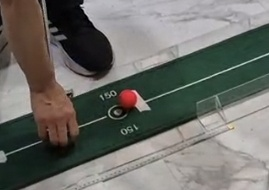
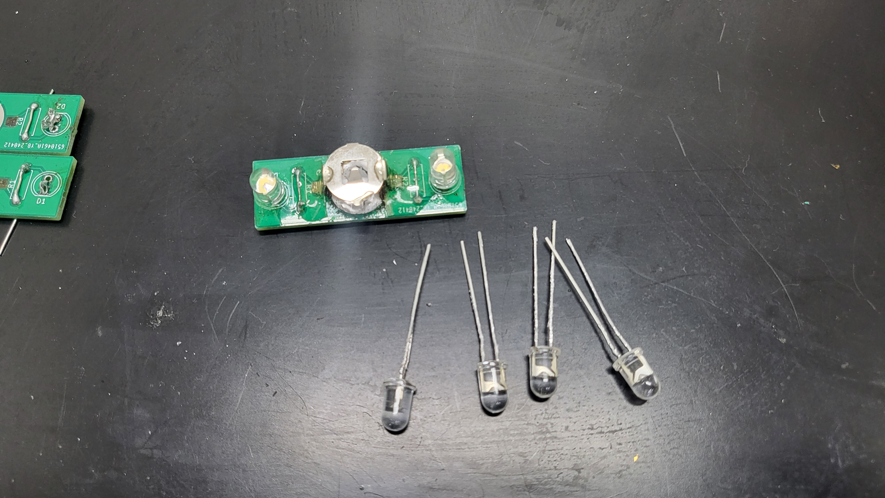

작성일 : 2024-05-26

---

```
    💡 회의 규정

    주간 회의는 개인별 오프라인 10시간 이상, 캡스턴 디자인실에서 진행되어야 한다.
    온라인 회의는 인정되지 않는다.

```

## **5월 4주차 (0520 - 0526)**

---

## **주요 업무**

---

- 1차 사용자 테스트를 위한 기능 완성
  - 공 추적 색상 변경
  - 헤드 정렬 - 기울기
  - 퍼팅 준비 우선순위 설정 로직
  - 비프음, tts 연결
- 1차 사용자 테스트

## **진행 상황**

---

## **1차 테스트를 위한 기능**

### **공 위치 추적 색상 변경**

기존에 opencv을 이용하여 노란색 공을 추적하였으나 색상 범위로 문제로 인해 골프 매트를 공으로 잡는 경우가 종종 있었다. 노란색이 초록과 가까운 색이어 문제가 되는 것으로 판단하였다.
따라서 초록색의 보색에 가까운 분홍색 공으로 변경하였으며 해당 공에 맞추어 opencv 색상 범위를 수정하였고 이후로 공을 완벽하게 추적할 수 있었으며 매트 위에 공이 없어도 골프 매트를 공으로 잘못 인식하는 케이스가 아예 없어졌다.



색상 범위 수정에 팀원이 작성한 색상 검출 코드를 이용하여 쉽게 BGR 값을 추출할 수 있었다.
<br/><br/>

### **헤드 정렬 - 기울기**

초기 하드웨어 설계와 현재 설계에 차이가 생기면서 기존 헤드에 부착된 IR sensord와 IR positioning Camera를 사용하여 헤드 정렬 여부를 파악하는 것이 불가능한 상황이었다. IR positioning Camera의 경우 해외 배송으로 구입할 수 없는 상황이었으며 (실제로 현재 사용 중인 것도 도착하는데 약 한달이 걸림) IR LED만 기존 모듈에서 적출하여 사용할 수 있었다.
따라서 헤드의 힐과 토우에 IR LED를 부착하여 헤드 정렬를 진행하기로 했다.

IR LED 적출 - 고장난 모듈에서 IR LED만 적출


IR LED 퍼터의 힐과 토우에 부착


힐과 토우에 부착한 IR LED 간 거리가 헤드 기울기에 따라 변화하는 특징이 있어 이를 이용하여 헤드 정렬을 판단하였다.

 <source src="https://github.com/TECH-PIONEERS/tech-pioneers.github.io/raw/main/public/5-4/헤드정렬.mp4" type="video/mp4">

퍼터가 기울어졌을 경우 시계 방향으로 기울어졌는지 반시계 방향으로 기울어졌는지 확인할 수 있으며 추후 기울어진 방향에 따라 비프음을 다르게 출력할 예정이다.

<br/><br/>

### **퍼팅 준비 우선순위 설정 로직**

퍼팅서포터에서 사용자에게 제공하는 기능이 다양하며 대부분의 기능을 비프음과 tts 사운드를 제공하고 있다.
알림 시 기능별 충돌이 발생하지 않도록 각 케이스별로 우선순위를 설정하였으며 우선순위에 따라 해당 비프음을 출력하도록 한다.

현재 퍼팅서포터의 우선순위는 다음과 같다.

1. 프레임 내 공의 여부
2. 공 정렬
3. 범위 내 헤드 여부
4. 헤드 정렬

tts용 flag를 하나 설정하여 헤드가 없고 공이 없는 경우 tts_flag와 각 케이스의 우선순위 상수를 비교하여 우선순위가 높은 케이스에 대한 동작이 출력되도록 하였다.
우선순위를 매직넘버로 작성하여 확장성을 높일 수 있었다.

```python
default = 999
ball_missing = 1
ball_align_bottom = 2
ball_align_up = 3
head_missing = 4
head_center_up = 5
head_center_down = 6
head_align = 7

dist_default = -999
upper_ir = 380
align_default = 888
```

```python
    #코드 중 일부
    if tts_flag.value == const.ball_missing:
        tts_flag.value = const.default
    if (utils.골과공정렬(goal_y - start_y, center[1]) == 2 or utils.골과공정렬(goal_y - start_y, center[1]) == 3) and tts_flag.value >= const.ball_align_up:
        if utils.골과공정렬(goal_y - start_y, center[1]) == 2:
            tts_flag.value = const.ball_align_up
        elif utils.골과공정렬(goal_y - start_y, center[1]) == 3:
            tts_flag.value = const.ball_align_bottom
    elif utils.골과공정렬(goal_y - start_y, center[1]) and tts_flag.value != const.default: tts_flag.value = const.default

```

<br/><br/>

### **비프음, tts 연결**

비프음은 높낮이가 다양한 소스파일을 수집하여 출력하고 있다.

퍼팅서포터에서는 아래 기능들을 비프음으로 제공한다.

- 공이 매트 위에 없음
- 헤드 추적이 불가능
- 헤드 정렬이 되지 않음
- 헤드 기울기 방향 (사용자 피드백, 추가 예정)

tts의 경우 pyttsx3 라이브러리를 사용하였다.
처음에 pyttsx3를 사용했을 때 라즈베리파이에서 음성이 제대로 출력되지 않는 현상이 있었으나 이는 가지고 있는 스피커의 문제였으며 스피커를 변경하여 해결할 수 있었다.
이를 해결하는 과정에서 espeak 라이브러리도 사용하였다.
현재 멀티프로세스로 동작하고 있는 tts_process에서 generate_tts라는 함수를 호출하여 tts를 출력한다.espeak 라이브러리는 예제 코드에서는 문제없이 작동했으나 프로젝트 코드 내에서 함수를 호출했을 때 출력이 되지 않는 모습을 보였다. pyttsx3를 사용하면서 이 문제는 해결하였다.

퍼팅서포터에서는 아래 기능들을 tts로 제공한다.

- 공과 헤드 사이의 거리 ex) 5cm
- 공이 정렬되지 않았을 경우 공을 어디로 움직여야하는 지 ex) 'up' or 'down'

#### 해결해야할 문제

소리출력 시 약 3초간의 슬립이 필요하여 다른 코드에 영향을 주지 않기 위해 이를 멀티프로세스로 작성하였으나 전체 코드에 영향을 주어 딜레이가 발생하는 문제가 있다.
공이 매트 위에 있다가 없는 경우 비프음을 출력하고 3초가 time.sleep하게 되는데 이때 센서 값 받아오는 프로레스와 opencv관련 프로세스도 모두 멈추어 3초간 이후 동작들이 쌓이고 현재 움직임에 대한 동작 n초 후에 반영이 되는 문제로 5주차에 가장 먼저 해결해야할 과제이다.

다른 케이스에 동일한 비프음을 사용하고 있는 게 있어 각 케이스별로 비프음이 확연하게 차이가 나도록 수정해야한다.

<br/><br/>

### **1차 사용자 테스트**

- 테스트 일자 : 2024년 5월 25일 토요일 오전 10:00
- 장소 : 브라보퍼블릭스크린골프 탄현점
- 테스트 인원 : 1명

  순서

  1. 퍼팅 서포터 소개
  2. 주의 사항 및 테스트 방법 소개
  3. 테스트 진행
  4. 인터뷰

  테스트 시작에 앞서 퍼팅서포터가 어떻게 생겼으며 현재 테스트하는 곳의 구조가 어떻게 되어있는지에 대해 설명드렸다. 영상 및 인터뷰 자료 사용에 대한 동의를 얻은 후 테스트를 진행했다.

  퍼팅 서포터 설명

  - 가로 206cm 세로 30cm의 매트 + 아크릴
    - 사용자가 서있는 부분에는 아크릴이 뚫려있다. 그 외의 부분에는 아크릴 벽이 5cm 정도 가로 세로로 다 막혀져 있다.
  - 가운데에 라즈베리파이 + 카메라가 놓여짐 → 이 카메라가 공중에 있으므로, 공을 잡을 때 컴퓨터 마우스를 잡을 때 처럼 잡지 말고, 공의 좌/우를 잡아주셔야 한다. (opencv 색상을 활용해서 공을 파악하기 때문이다)
  - 퍼터 헤드 3면에 ir 센서가 부착되어져 있음
    - 토우, 힐, cavity(캐비티) 에 설치되어 있음
  - 케이스별 비프음 소개

  1차 테스트 기능

  - 공 여부
  - 공 정렬 (업다운 tts 제공)
  - 헤드 추적
  - 헤드 정렬 여부

  사용자 피드백 1 - 기능

  - 공 여부 비프음과 헤드 정렬 여부 비프음이 비슷하여 헷갈린다.
  - 현재는 정렬안됐을 때 하나의 비프음이 나고 정렬이 됐을 때 소리가 아예 안나는데 정렬 완전히 됐을 때 소리가 났으면 좋겠다. 그리고 헤드 기울기에 대해서는 방향에 따라 비프음 음낮이를 다르게해서 왼쪽으로 기울어진 경우 높은음, 오른쪽은 낮은음이 제공되었으면 좋겠다. 몇 도까지는 의미가 별로 없다.
  - 기울기말고도 헤드 그루브 중앙과 공이 일치하는 게 매우 중요하기 때문에 이에 대해서도 비프음으로 알려줬으면 좋겠다. ex) 위로 땡겨야할 경우 높게 아래로 땡겨야할 경우 낮게
    위 기능으로 헤드 기울기 및 위치 정렬만 되어도 열고 닫고는 사용자가 가능하다.
  - 정렬되었을 때 공과 헤드 사이의 거리를 tts로 안내해주는 건 좋다.
  - 추가로 공을 쳤을 때 얼마나 이동했는지, 제대로 못쳤을 경우 왼쪽으로 빠졌는지 오른쪽으로 빠졌는지 대해서도 안내해주는 기능이 있으면 좋을 것 같다.

  사용자 피드백 2 - Q&A

  Q1) 사용하면서 불편한 점<br/>
  A1) 불편한건 없었다. 다만 앞에서 말했지만 비프음이 명확하게 구분될 것. 사용하면서 익숙해지는 것.
  다만 처음 연습하는 사람이 센서를 만질 수 있기 때문에 견고하면 좋을 것.

  Q2) 리모컨을 추가하려고 하는데 이부분에 대한 생각<br/>
  A2) 굳이 필요할 필요없을 것 같다. 공을 만지고 어드레스를 잡은 상태에서 리모콘까지 사용하는건 쉽지 않을 것 같다.

  사용자 코멘트

  시각장애인 골프 대회에 대해 언급하시면 대회 연습용으로 사용하면 매우 좋을 것 같다. 시각장애인들도 골프를 처음할 때 연습용으로 이런 매트를 사용하는데 익숙해지면 그 기능에 대해 쓰는데 크게 지장이 없을 것 같다.
  전맹에게 더 도움이 될 것 같다는 생각이 든다. 시각장애인은 골프 연습을 하려면 무조건 비장애인과 동반해야한다. 목표가 스스로 골프 연습할 수 있는 환경을 구성하는 건데 이 프로젝트가 이러한 환경을 구성하는데 도움이 될 것 같다.

 <source src="https://github.com/TECH-PIONEERS/tech-pioneers.github.io/raw/main/public/5-4/first_test.mp4" type="video/mp4">

tech-pioneers 테스트 후기

테스트 이후 방향성을 확실히 할 수 있었다. 남은 시간동안 핵심적으로 다룰 기능 및 추가해야할 기능들을 확인할 수 있는 시간이었다. 우리가 눈을 감고 테스트했을 때 사용에 어려움이 있을 것이라고 고려했던 부분들이(예를 들어 공 주변에 헤드를 위치하는 것) 테스터에게는 오히려 아무런 문제가 되지 않는 것이 매우 많았다. 퍼팅서포터를 어떻게 이용하시는지 모습을 확인했기 때문에 이를 기반으로 2차 테스트는 1차보다 사용자 편의적인, 사용자 맞춤형으로 업그레이드가 가능할 것 같다.

<br/><br/>

## **회고**

1차 테스트 및 인터뷰를 통해 사용자에게 필요한 기능을 확실히 할 수 있었다. 이는 2차 테스트까지 완성해야할 기능들의 방향성 및 우선순위를 결정하는데 큰 도움이 되었다.
테스트를 통해 시각장애인이 퍼팅을 어떻게 하는지 완벽히 이해할 수 있었으며 이는 앞으로의 개발에 큰 도움이 될 것으로 보인다. 우리가 중요하게 혹은 사용에 걱정했던 부분이 시각장애인에게 별로 어렵지 않은 문제임을 깨닫는 것만으로 아주 값진 시간이었다. 또한 테스터분께서 먼저 해당 제품의 가치에 대해 매우 긍정적으로 이야기해주셔서 여태까지 진행하면서 힘들었던 것들에 대해 보상을 받는 한 주였다. 또한 시각장애인에게 현재 진행 중인 졸업작품에 대한 가치에 대해 말씀해주시고 어디에 적용하면 좋을지까지 추천해주셔서 정말 감사했다.

<br/><br/>

## **TO DO LIST**

- tts, 비프음 출력 delay 문제 해결
- 헤드 위치 유도 기능
- 헤드 정렬 유도 비프음 추가
  <br/><br/>
