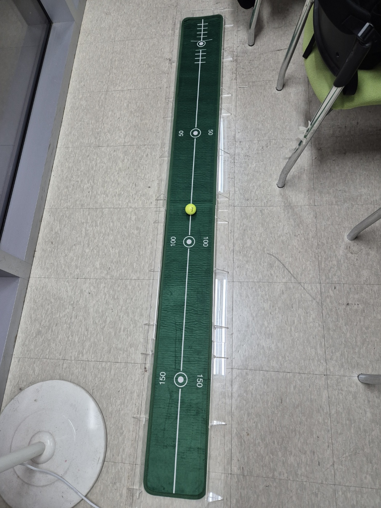
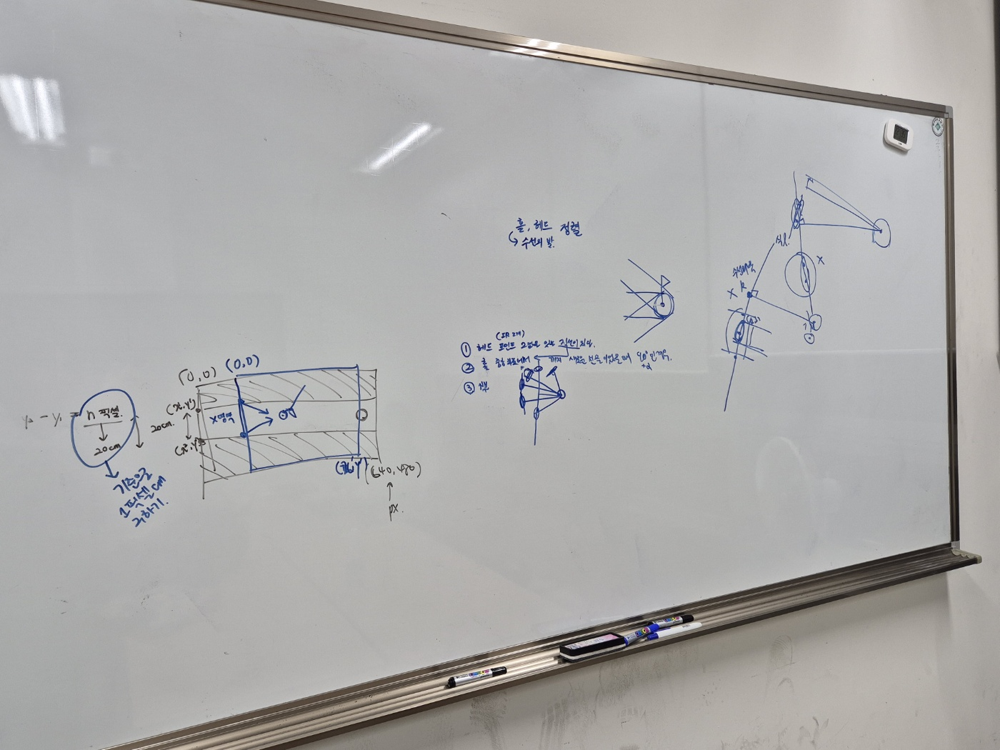

### 🗓️ 회의 일자

2024.04.09
(18:00 - 22:00)

### 🕛 작성일

2024.04.10

### 🚩 회의 장소

인천대학교 / 온라인(구글밋)

### 🤝 회의 참석자

구민성, 류지수, 박주미, 한예지

### 🙎 작성자

류지수

## 📣 어젠다

- 부품 리스트 확인
- 레이저커터 출력 및 조립
- 공,헤드,홀 정렬 로직 구상
- IR 리모컨 테스트

## ✏️회의 내용

1. **부품 리스트 확인**

   - 도착한 부품 확인
   - 구매한 카메라가 CSI가 라즈베리파이5와 호환되지 않아 케이블 확인함
      

2. **모델링 출력 및 조립**

   - 모델링 파일 레이저커터로 출력
   - 출력한 프레임 조립
   - 
      

3. 공,헤드,홀 정렬 로직 구상

   - 
   - 수선의 발을 이용한 코드 작성
      

4. IR 리모컨 테스트

   - IR 수신기 라즈베리파이에 환경 세팅 진행
   - 커널 버전이 업그레이드됨에 따라 IR 수신기 환경 세팅이 변경된 부분이 많았음
   - 리모컨 버튼 눌렀을 때 IR 수신기 작동하는 것 확인
      

5. 칸반 세팅

   - 진행도에 맞게 깃허브 칸반 수정
