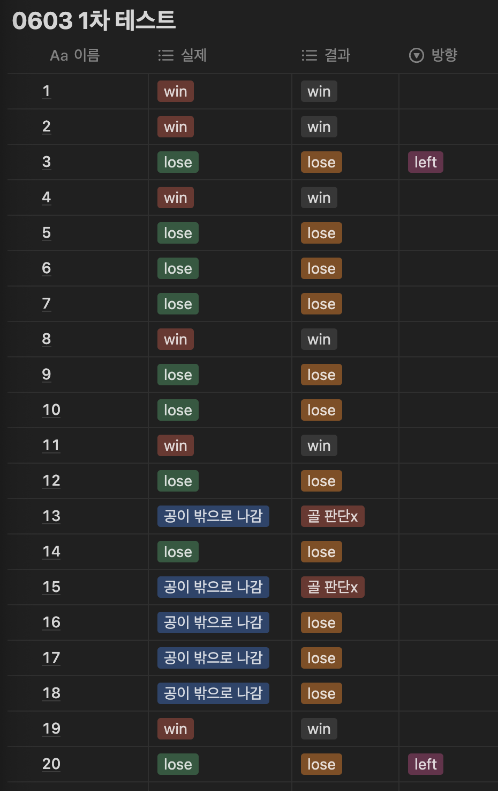

### 🗓️ 회의 일자

2024.06.01
2024.06.03

### 🕛 작성일

2024.06.13

### 🚩 회의 장소

인천대학교

### 🤝 회의 참석자

구민성, 류지수, 박주미, 한예지

### 🙎 작성자

류지수

## 📣 어젠다

- 예외케이스 해결
- 테스트

## ✏️회의 내용

1. **예외 케이스 해결**

   - **공이 골에 들어갔는데 lose가 뜨는 경우**

     - 공이 goal 범위 내에 있을 경우 홀에 들어갔다고 판단한다. 그러나 홀에 들어가도 넣지 못했다고 판단하는 경우가 있었다.
     - goal x,y 좌표에 대한 threshold 값이 정확하지 않다고 판단하였다.
     - 카메라 보정 및 위치 상 goal x, y threshold 값을 다르게 설정하였고 goal 문제를 해결할 수 있었다.
       <br/><br/>

   - **공을 친 후 game lose 상황에서 TTS가 뜨지 않는 문제**

     - tts_flag 값을 확인한 결과 game_lose와 head_missing 상황이 번갈아서 나타난 것을 확인하였다. head_missing에 shot_Flag == False 조건을 추가하여 공을 친 후에는 헤드 미싱을 판단하지 않도록하여 해결할 수 있었다.
       <br/><br/>

   - **유틸 함수 수정 및 추가**
     - 공 방향을 판단하는 함수 일부를 수정하였다. 홀 안에서 공의 방향이 바뀌어
       공 방향 판단 함수 내부에서 현재 공이 홀 안에 있는지 파악한 후 이전 값과 현재 값 모두 공 안에 있을 경우에는 벽에 부딪히는 조건을 돌지 않고 return 한다.
     ```
     def temp_return_ball_direction(previous_pos_x, previous_pos_y, current_pos_x, current_pos_y, previous_direction, threshold=5)
     ```

2. **테스트**

   - 6월3일자 테스트 진행
     공을 친 후 실제 결과와 퍼팅서포터의 결과를 비교하는 표를 작성하였다.
     공이 밖으로 나가는 경우에 대해 제대로 판단하지 못하는 모습을 보였다.
     이미지 중 골 판단을 아예 못한 것은 너무 세게 쳐서 opencv가 공을 못잡아서 나타나는 결과이다.
     
