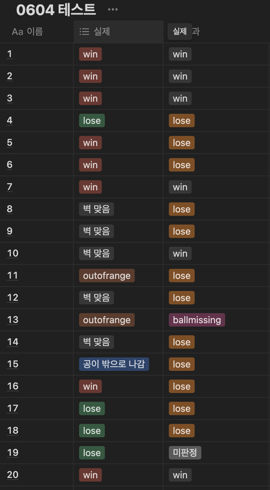

### 🗓️ 회의 일자

2024.06.04

### 🕛 작성일

2024.06.13

### 🚩 회의 장소

인천대학교

### 🤝 회의 참석자

구민성, 류지수, 박주미, 한예지

### 🙎 작성자

류지수

## 📣 어젠다

- 테스트
- 디버깅
- TTS 속도 조절

## ✏️회의 내용

1. **테스트**

   - 벽 관련 코드 수정 후 테스트 진행
   - 현재 코드에서 제대로 동작하지 않는 부분들을 확인할 수 있었다.
     
     <br/><br/>

2. **디버깅**

   - 테스트 중 발견된 문제들을 순차적으로 해결하였다.
   - **벽 맞고 윈 판정**

     - 공이 벽을 맞고 홀에 들어갔을 때 win 판정이 나는 경우가 있어 벽 관련 threshold 값을 조정하였다.
       - default 5 -> 2.5
       - 이는 계속 테스트를 진행하며 바뀔 수 있는 값이다.
         <br/><br/>

   - **실제 결과 값과 퍼팅서포터 결과 값이 다른 문제**

     - 공의 움직임을 판단하는 함수를 멀티프로세스로 돌리며 공이 멈췄다고 판단했을 때 결과 값을 출력하는데 완전히 멈추지 않은 경우가 있었다.
     - 공이 완전히 멈추었을 때 판단하기 위해 공이 움직이지 않는다고 판단되면 이떄부터 3초 timer를 설정하여 3초 후 공의 위치를 기준으로 결과 값을 출력한다.
     - timer를 추가한 후 결과 값이 다른 문제를 해결할 수 있었다.

     ```python
     #check_movement
       if abs(current_x-prev_ball_position[0]) >= threshold and align_success.value == True:
           if shot_flag.value == False:
               shot_flag.value = True
               if isMovingTime[1] == False:
                   isMovingTime[0] = time.time()
                   isMovingTime[1] = True
     ```

     ```python
     #stream_opencv
       now = time.time()
       if isMovingTime[1] == True:
         timer = now - isMovingTime[0]
         if timer >= 3:
           #골 여부 판단
     ```

3. **TTS 속도 조절**

- TTS 속도를 코드 내부에서 rate를 변경하였으나 rate가 변경되지 않는 문제가 있었다. 이를 해결하기 위해 라이브러리가 설치된 위치로 이동하여 라이브러리의 init rate 값을 변경하였다. 200 -> 180으로 속도를 수정하였으며 정상적으로 작동하였다.

## Todo

홀 위치 변경 필요

- 골이 홀 끝 쪽에 가면 아예 공이 잡히지 않는 경우가 있다.
- 홀 위치 앞쪽으로 변경 및 x 값 수정 필요하다.

예외 케이스 확인을 위해 영상 찍어서 확인
