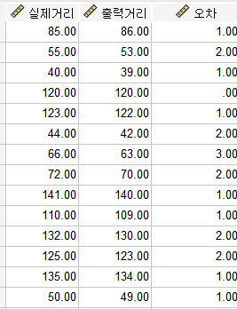
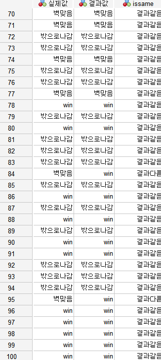

### 🗓️ 회의 일자

2024.06.13

### 🕛 작성일

2024.06.13

### 🚩 회의 장소

인천대학교

### 🤝 회의 참석자

구민성, 류지수, 박주미, 한예지

### 🙎 작성자

한예지

## 📣 어젠다

- 거리 정확도 테스트
- 퍼팅 서포터 테스트 100번 이상 수행
  

## ✏️회의 내용

1. 거리 정확도 테스트

- 공이 움직인 거리 오차: 약 1.4cm

  

2. 퍼팅 서포터 테스트 100번 이상 수행

- 모든 테스트 과정은 영상을 촬영하여 결과를 확인하였다.

  
