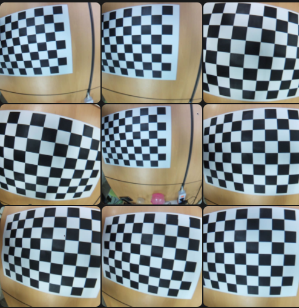
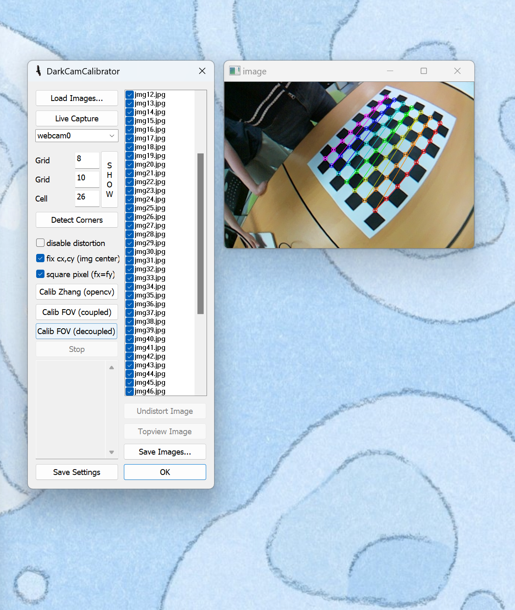
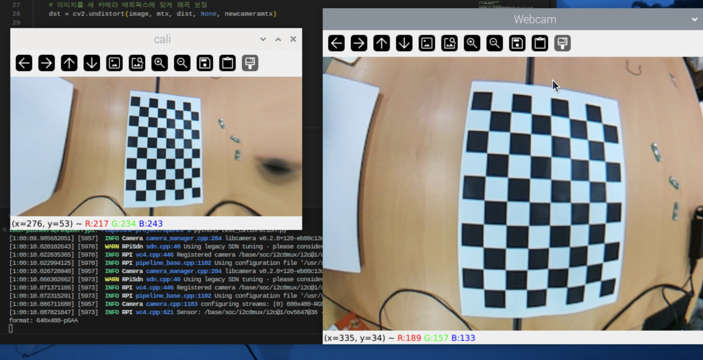
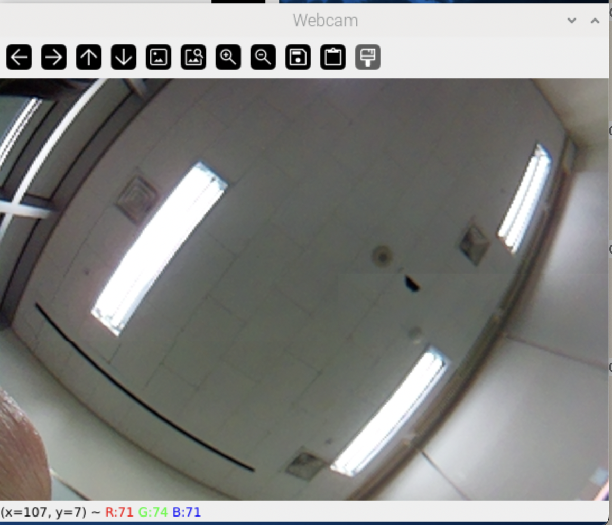
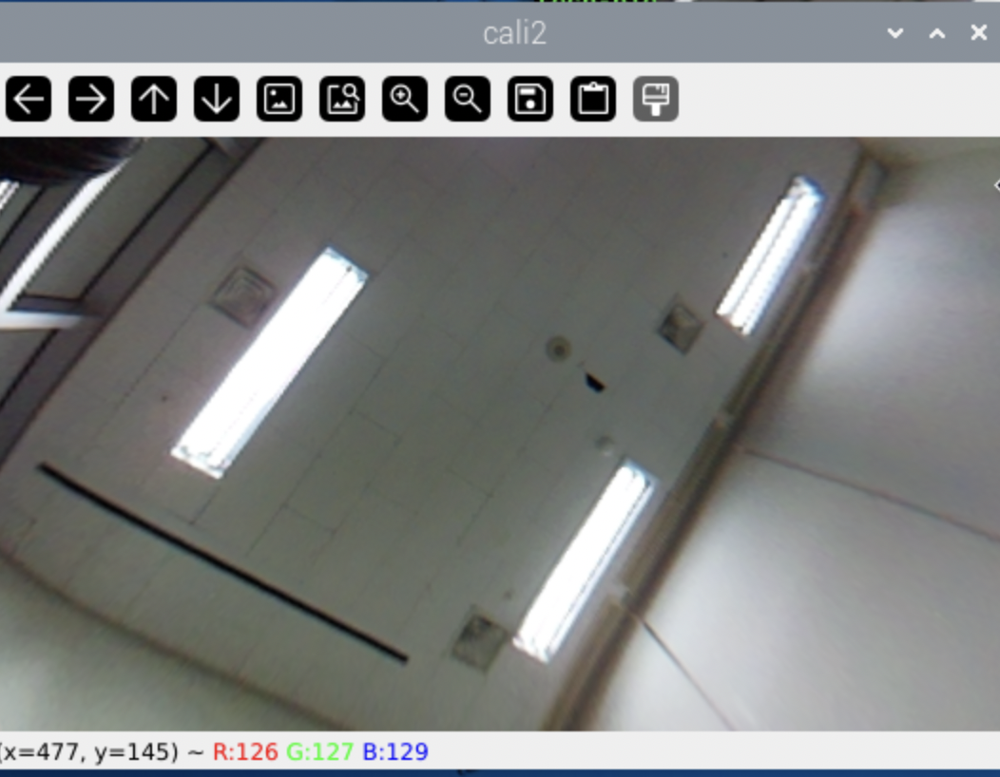

### 🗓️ 회의 일자

2024.05.01
(10:00 - 16:00)

### 🕛 작성일

2024.05.04

### 🚩 회의 장소

인천대학교

### 🤝 회의 참석자

구민성, 류지수, 박주미, 한예지

### 🙎 작성자

류지수

## 📣 어젠다

- 납땜
- picamera 연결
- 어안카메라 보정

## ✏️회의 내용

1. 납땜

   - IR sensor 납땜
   - 
   - 도착한 기판에 IR sensor 2개를 왼쪽 오른쪽에 부착
   - 가운데는 배터리 장착

     <br/>

2. picamera 연결

   **코드 수정 1**

   - 기존 webcam으로 테스트하던 코드를 picamera를 사용하는 코드로 변경
   - 기존에는 cv2.VideoCapture(0)로 frame을 받아왔으나 사용 중인 어안카메라의 frame을 받아오기 위해서는 picamera2 라이브러리를 사용해야했다.

   ```
   //기존 방식
   vs = cv2.VideoCapture(0)

   //새로운 방식 (import 생략)
    picam2 = Picamera2()
    picam2.preview_configuration.main.size=(640, 400)
    picam2.preview_configuration.main.format = "RGB888"
    picam2.start()

    while True:
        cap = picam2.capture_array()

   ```

   - 라즈베리파이5에는 picamera2가 기본으로 설치되어있으나 OS setting에 문제가 있었는지 no moduled named picamera2가 뜨면서 picamera를 제대로 찾지 못하였다.
   - 팀원이 가지고 있는 라즈베리파이4를 이용하여 새롭게 작성한 코드를 테스트한 후 돌아가는 것을 확인하였다. 이후 라즈베리파이5 os를 초기화하고 다시 세팅하는 시간을 가졌다.

   **코드 수정 2**

   - 기존에 클릭한 영역을 크롭해주는 코드를 Picamera에 맞게 수정하였다.
   - 기존 코드 동작 방식 : 자를 영역 클릭 -> 이전 window destroy -> 크롭된 새로운 window open
   - 바뀐 코드 동작 방식 : 자를 영역 클릭 -> 크롭된 새로운 window open
   - picamera를 사용했을 때 이전 window를 destory 시키면 `Segement fault` 오류가 발생하여 기존 window도 유지하는 방식으로 코드를 수정했다.

   ```
   //cv2.destoryWindow 주석처리
   def get_position(event, x, y, flags, params):
    global start_x
    global start_y
    global end_x
    global end_y
    global flag
    if event == cv2.EVENT_LBUTTONDOWN:
        print("Clicked at (x={}, y={})".format(x, y))
        if flag == 0:
            start_x = x
            start_y = y
            flag = 1
        elif flag == 1:
            end_x = x
            end_y = y
            flag = 2  # flag를 2로 설정하여 crop할 좌표를 모두 선택한 상태로 변경
            utils.pixel_to_cm(end_y-start_y)
            # cv2.destroyWindow('cap')  # 마우스 클릭 이벤트를 위한 창 닫기
    return

   ```

3. 어안 카메라 보정

   - 링크를 참고하여 사용 중인 카메라 렌즈의 왜곡 정도를 파악하고 해당 데이터를 사용하여 카메라 보정을 진행하였다.
     https://m.blog.naver.com/tobsysco/90188394402
   - 먼저 보정하는 데 사용하기 위한 패턴을 프린팅하고 카메라로 해당 패턴을 다양한 각도에서 촬영한다.
   - 적게는 20장으로도 보정할 수 있다고하나 우리는 약 120장의 이미지를 사용하였다.
   - 

     보정하지않은 상태로 데이터 수집

   - 

     GML Camera Calibration ToolBox를 이용하여 보정을 위한 데이터 추출

   - 보정 데이터 수집

   ```
    -------------v1--------------- (img)
    fx = 297.454574
    fy = 297.454574
    cx = 300.000000
    cy = 200.000000
    k1 = -0.237153
    k2 = 0.025004
    p1 = -0.008951
    p2 = -0.010148

    -------------v2--------------- (jmg)
    rms = 2.948340
    fx = 335.827093
    fy = 335.827093
    cx = 300.000000
    cy = 200.000000
    k1 = -0.354948
    k2 = 0.102152
    p1 = -0.041716
    p2 = -0.002760
    hfov = 83.5deg
    vfov = 61.6deg

    -------------v3--------------- (img+jmg)
    rms = 3.402954
    fx = 297.677019
    fy = 297.677019
    cx = 300.000000
    cy = 200.000000
    k1 = -0.266982
    k2 = 0.056298
    p1 = -0.030921
    p2 = -0.005686
    hfov = 90.4deg
    vfov = 67.8deg

   ```

   - 수집한 데이터를 바탕으로 보정 코드 작성한 결과
   - 
   - 보정x 
   - 보정O 
