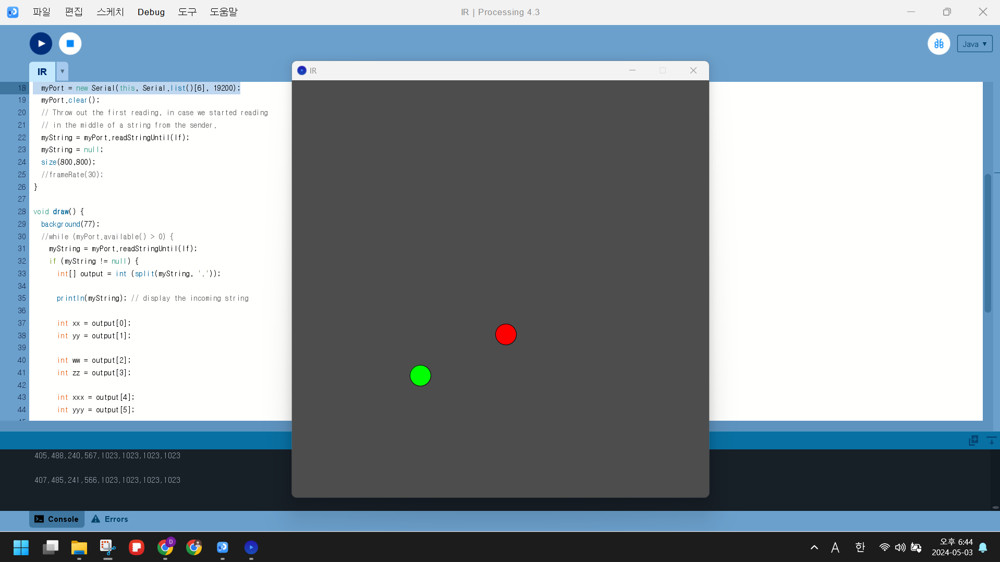
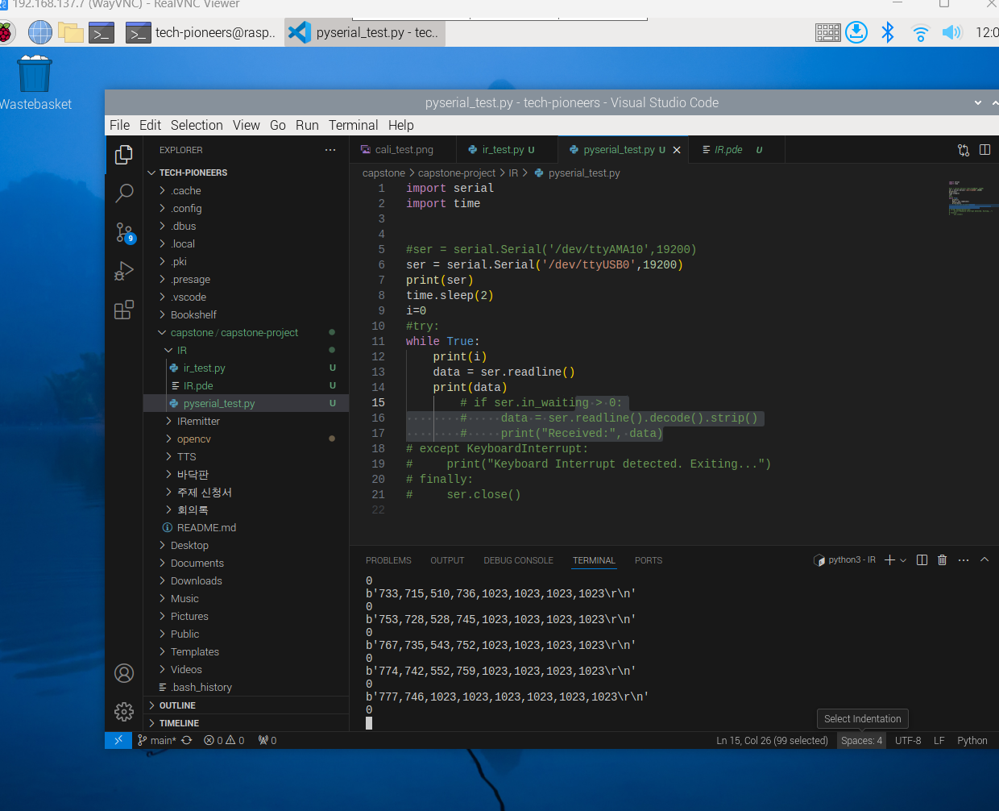
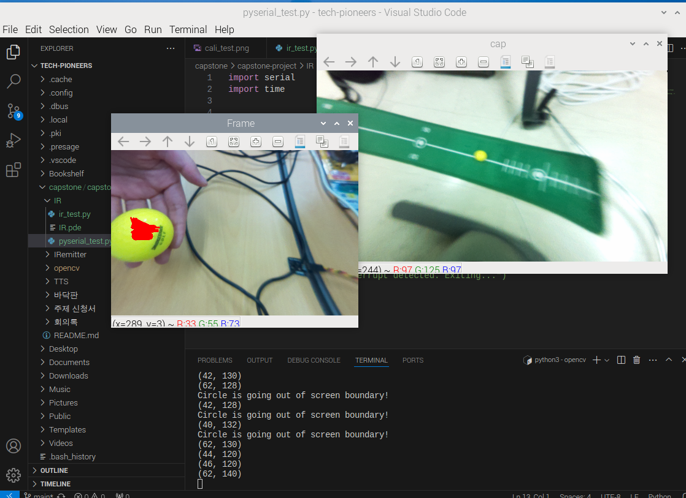

### 🗓️ 회의 일자

2024.05.03
(18:00 - 21:00)

### 🕛 작성일

2024.05.04

### 🚩 회의 장소

인천대학교

### 🤝 회의 참석자

구민성, 류지수, 박주미, 한예지

### 🙎 작성자

박주미

## 📣 어젠다

- IR Positon 테스트
- 공 식별 코드 + 비프음 알림 코드 합치기

## ✏️회의 내용

1. **IR Position 테스트**

   - 아두이노 코드로 IR 작동 테스트 진행
     - 4개의 IR 센서가 존재했을 경우, 두 개의 IR 카메라가 IR 센서를 중복해서 식별하는 일이 발생. 해당 문제를 방지를 고려한 코드 작성 필요
       
   - 아두이노가 아닌 라즈베리파이 환경에서 사용할 수 있도록 pyserial 라이브러리 사용해 데이터 값 받아오는 코드 작성

     - opencv > pyserial_test.py
     - IR 센서를 인식하지 못할 경우 : 1023
     - IR 센서를 인식할 경우 : 1023보다 작은 값

     
      

2. **공 식별 코드 + 비프음 알림 코드 합치기**
   - 공 외곽선이 화면의 1/3을 벗어난 경우 경고 문구 출력하는 코드 작성
     
   - 이전에 작성된 비프음 알림 코드와 공 식별 코드를 합쳐 범위를 벗어날 경우 비프음 알림 연동 테스트
