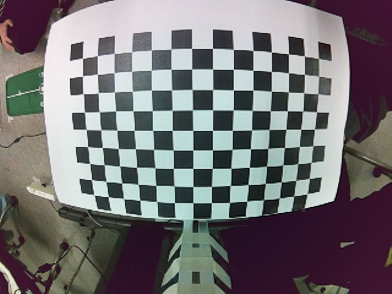
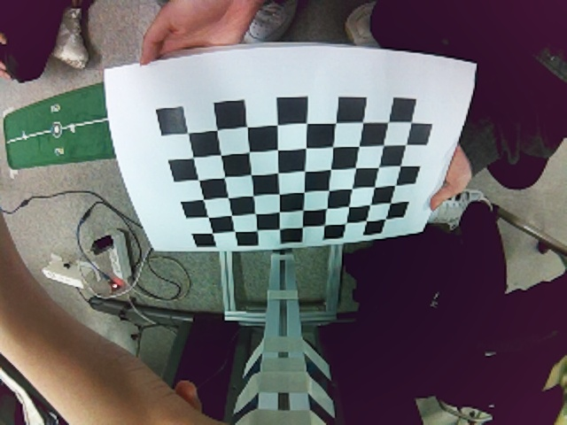
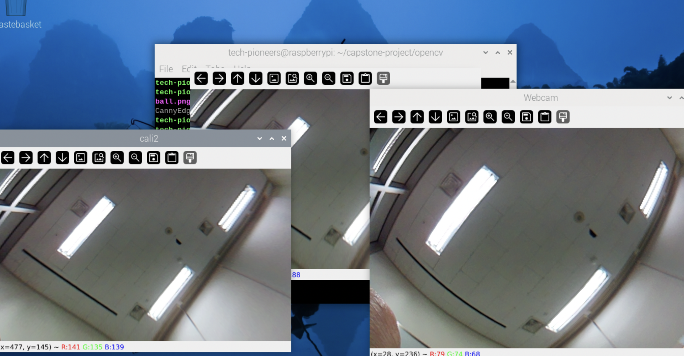
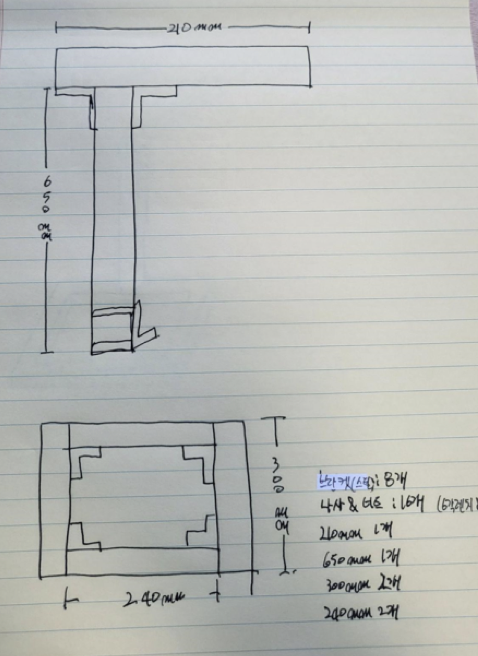
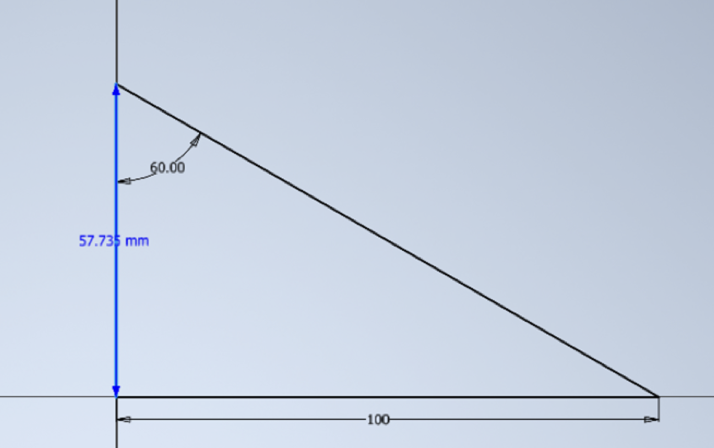
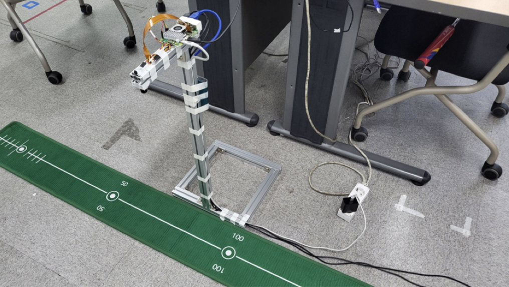

### 🗓️ 회의 일자

2024.05.16

### 🕛 작성일

2024.05.18

### 🚩 회의 장소

인천대학교

### 🤝 회의 참석자

구민성, 류지수, 박주미, 한예지

### 🙎 작성자

류지수

## 📣 어젠다

- 광각 카메라 보정 2차
- 프로파일 설치

## ✏️회의 내용

1. **광각 카메라 보정 2차**

   - 체크보드를 다양한 패턴으로 출력하여 카메라 보정을 진행함
   - 3가지의 패턴으로 이루어진 90장이 넘는 이미지를 사용하여 보정함
   - 다양한 각도에서 이미지 촬영
     
     
      
     [사용한이미지 링크](https://github.com/TECH-PIONEERS/capstone-project/tree/main/calibration/image3)
   - 한 가지 패턴의 이미지만 사용했떤 1차와 달리 왜곡이 훨씬 적은 결과를 얻을 수 있었음

   - 보정1차 : 가장자리로 갈 수록 왜곡현상이 나타남
     
   - 보정2차 : 가장자리에도 왜곡현상이 거의 없음
     
   -   

2. **프로파일 설치**

   - IR mapping을 위해 카메라 위치 고정 및 선정리가 필요하여 프로파일을 제작함
     
     
     
   -   
