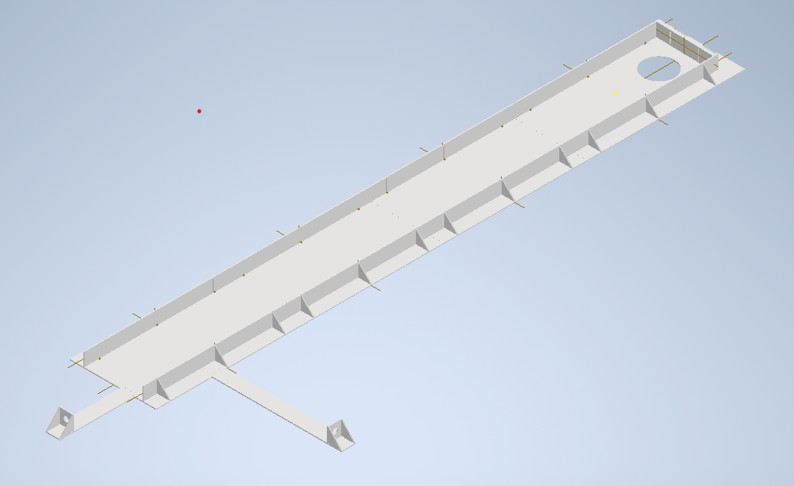

### 🗓️ 회의 일자

2024.05.17

### 🕛 작성일

2024.05.19

### 🚩 회의 장소

인천대학교

### 🤝 회의 참석자

구민성

### 🙎 작성자

구민성

## 📣 어젠다

- 붉은색 공 인식
- 센서 마운트 하판 제작

## ✏️회의 내용

1. **붉은색 공 인식**

   - 붉은색 공을 인식하기 위해 컬러 코드를 선정하였음.
   - 반복된 시도에도 불구하고 실패하였음.
   -   

2. **센서 마운트 하판 제작**

   - IR mapping을 위해 카메라 위치 고정 및 선정리가 필요하여 센서를 장착할 수 있는 설계의 하판을 제작하였음.
   - 제작은 메이커스페이스에 의뢰하였음
     
     
   -   
