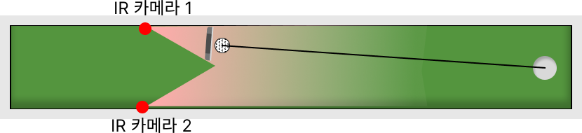
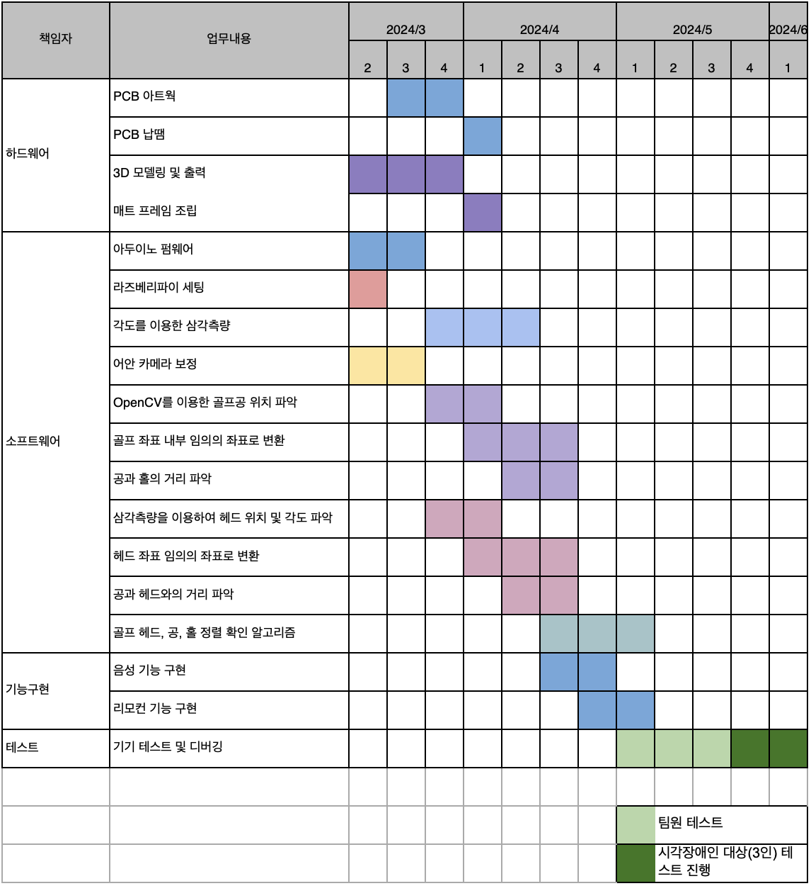

<h1 style='color: #7153ED; font-weight: bold'>퍼팅서포터</h1>

<image style='width: 50%' src='./public/human.png' />

 
 

### 핵심 주제

시각장애인용 골프 퍼팅 훈련 매트를 제작함으로써 퍼팅 연습을 도와준다.

### 핵심 요소

1. **훈련 매트 설계 및 제작**
   - **필요 이유** : 시중에 나온 제품과 달리 시각장애인 맞춤형으로 만들기 위해 필요하다.
   - 구현 핵심 요소
     - 매트의 좌, 우, 홀 뒤에 가림막을 설치하여 공이 매트 밖으로 나가는 케이스 방지
     - 골프공 위치 인식 위한 카메라 설치
2. **골프공과 홀 사이 거리 파악**
   - **필요 이유** : 시각장애인은 현 위치에서부터 홀까지의 퍼팅 거리를 육안으로 알 수 없기에 골프공의 위치를 청각적인 요소로 알려줘야 한다.
   - 구현 핵심 요소
     - 골프공 위치 인식 기능
       - 어안 카메라 보정
       - opencv 색상 기반 골프공 추적
       - IR 카메라 좌표와 opencv로 획득한 골프공 위치 좌표를 일치 시키는 작업
     - 공과 홀까지의 거리 계산 및 알림
3. **헤드 정렬**
   - **필요 이유** : 골프에서 열거나 닫는 등 골퍼의 판단에 따라 치려면, 우선 헤드 정렬이 되어야 한다. 하지만 시각장애인은 비장애인과 다르게 헤드 정렬을 확인할 수 없다.
   - 구현 핵심 요소
     - 홀, 공, 헤드 정렬
       - 홀과 공 정렬
       - 공과 헤드 정렬
4. **세부기능**
   1. **공의 궤도 추적하여 알림**
      - 필요 이유 : 시각장애인이 어떻게 골프공을 쳤는지에 대한 피드백 제공하기 위함
   2. **음성 기능 제공**
      - 필요 이유 : 시각장애인은 주로 청각에 의존하여 판단을 한다. 판단을 위해 TTS와 비프음을 사용한다. 골프 특성상 많은 TTS를 제공하면 긴 문장을 끝까지 듣기 부담스러우므로 간단한 비프음을 주로 활용한다.
      - 구체적인 상황 별 음성 제공

### 일정

[👉 회의록](https://tech-pioneers.github.io/docs/meeting)

---
